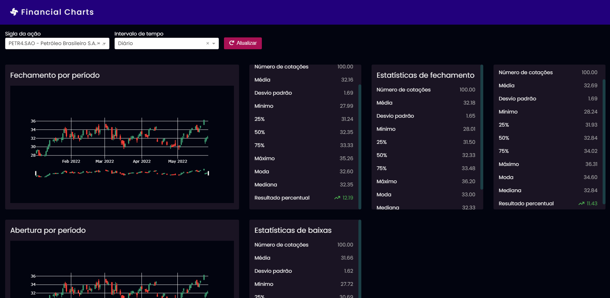

# Financial Charts



Stock market share analytical Dashboard, providing statistics such as average, mode, median, min, max, etc...

This application also features graphical analysis of the market value of shares.

All data is live-fetched from AlphaVantage (https://www.alphavantage.co/).

## Table of Contents

- [Financial Charts](#financial-charts)
  - [Table of Contents](#table-of-contents)
  - [Setup <a name='setup'></a>](#setup-)
    - [Cloning repo <a name='setup-clone'></a>](#cloning-repo-)
    - [Setting-up dependencies <a name='setup-dependencies'></a>](#setting-up-dependencies-)
      - [Anaconda <a name='setup-dependencies-anaconda'></a>](#anaconda-)
      - [Pip <a name='setup-dependencies-pip'></a>](#pip-)
    - [Customizing environment variables (required) <a name='setup-env'></a>](#customizing-environment-variables-required-)
      - [Available variables](#available-variables)
    - [API Key encryption (recommended) <a name='setup-encryption'></a>](#api-key-encryption-recommended-)
    - [Docker](#docker)
    - [Running local server <a name='setup-run'></a>](#running-local-server-)
  - [Authors <a name='authors'></a>](#authors-)


## Setup <a name='setup'></a>

### Cloning repo <a name='setup-clone'></a>

First, make sure you have a python environment ready in your machine.

Clone this repo and cd into the project's directory.

```bash
  git clone https://github.com/paulochimelo/Projeto-Estatistica.git

  cd "Projeto-Estatistica"
```

### Setting-up dependencies <a name='setup-dependencies'></a>

#### Anaconda <a name='setup-dependencies-anaconda'></a>

Anaconda/Miniconda users will find an environment.yml file, through which an Anaconda environment containing all project dependencies may be created.

```bash
  conda env create --file environment.yml
```

**(optional)** The default name for the newly created environment is "paulo-charts", but you may also provide a different name through the conda --name option.

```bash
  conda env create --file environment.yml --name myenvironment
```

Activate the resulting environment.

```bash
  conda activate paulo-charts
```

#### Pip <a name='setup-dependencies-pip'></a>

Pip users may use the provided requirements.txt file to install the project's dependencies.

```bash
  pip install -r requirements.txt
```

### Customizing environment variables (required) <a name='setup-env'></a>

Environment dependant variables must be configured by creating a .env file in the project's root directory.

On linux based environments, this file can be easily created through the "touch" command.
```bash
  touch .env
```

Windows users may use the "echo" command.
```bash
  echo > .env
```

#### Available variables

- APPLICATION_MODE **(required)**: [debug|production].
- ICONS_CDN_SCRIPT_URL **(required)**: FontAwesome icon kit url.
- ENCRYPTION_KEY **(required)**: The key used to encrypt sensitive info, such as the AlphaVantage api key (must be a valid AES-128 key).
- API_KEY **(required)**: AlphaVantage api key (must be AES-128 encrypted).

### API Key encryption (recommended) <a name='setup-encryption'></a>

In order to ensure the utmost security, api keys are stored as AES-128 hashes.

You may encrypt your own AlphaVantage api key through the encryption utility distributed along with this repo.

```bash
  python encryptionUtility.py myapikey
```

Sample output

```bash
  ~$ python encryptionUtility.py myapikey
  -
  -
  Output key:
  ZAusn0cRV27FBLQAIeqAaGLN_IZ9pJOvtgT7dl4mzhk=  # this is your ENCRYPTION_KEY
  Output value:
  gAAAAABikQ49a0KnFw-EEk8ymVa9TRgIxHCJNceTqJ9kymvFYcQzimuccDuqNTAMrGa_JPEJGSc4EnftlFGBxLwnWiSk6BZLjg== # this is your API_KEY
```

### Docker

There is also a Dockerfile available which can be used to run a docker container that automatically installs all dependencies.

First, make sure you have [Docker](https://docs.docker.com/get-docker) installed on your machine.

Then, build the docker container

```bash
  docker build -t projeto-estatistica .
```

And finally, start up the application

```bash
  docker run -it -p 80:8050/tcp -e APPLICATION_MODE=debug -e ENCRYPTION_KEY=[your_encryption_key] -e API_KEY=[your_api_key] -e ICONS_CDN_SCRIPT_URL=[your_font_awesome_kit_url] --rm projeto-estatistica 
```
> Please note that this command will start up a docker container mapped to port 80 on the host machine, running on debug mode.

### Running local server <a name='setup-run'></a>

Finally, start up the local server

```bash
  python app.py
```

And browse over to http://localhost:8050, to check-out the Dashboard.

## Authors <a name='authors'></a>

- [@paulochimelo](https://www.github.com/paulochimelo)

